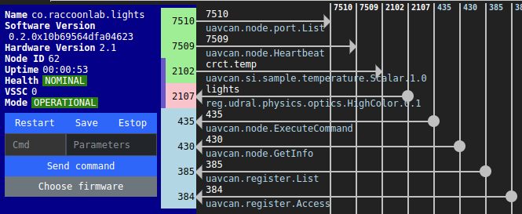
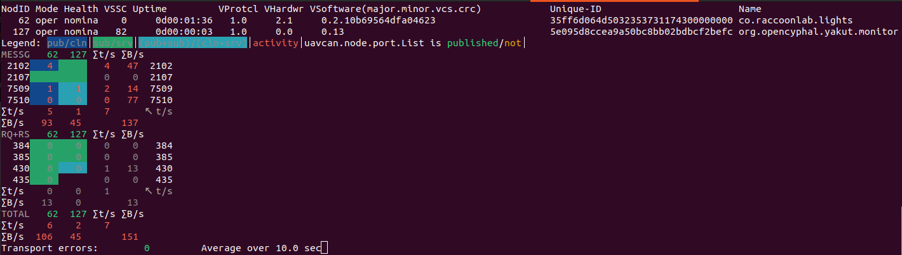

# UAV Lights node custom application

This repository introduces a simple Cyphal application written for the [UAV Lights](https://docs.raccoonlab.co/guide/ui_leds/) node. Based on this project you can write your custom application if the original application doesn't suit your requirements.

| View | Top view | Bot view |
| ---- | --- | ------ |
|  |  | |

The default capabilities of the node are shown on the picture below:





## 1. Brief hardware description

The node has 6 user pins. By default 4 of them are configured as PWM and 2 of them as UART RX, but you can change the configuration to support I2C, ADC, GPIO or something else.

Please, refer to the [UAV Lights hardware](https://docs.raccoonlab.co/guide/ui_leds/hardware.html) page for the details.

Below you can see a brief description of hardware capabilities:


## 2. STM32CubeMX

The pinout configuration is based on the [STM32CubeMX](https://www.st.com/en/development-tools/stm32cubemx.html) generated project: [Libs/stm32-cube-project](https://github.com/RaccoonLabHardware/lights-v0-software) with the following configuration:


If you need to use custom pinout configuration, it is recommended to use either [STM32CubeMX](https://www.st.com/en/development-tools/stm32cubemx.html) or [STM32CubeIDE](https://www.st.com/en/development-tools/stm32cubeide.html) to modify .ioc file and regenerate your custom project.

## 3. Prerequisites

You are expected to use the following software:
- (optional) [STM32CubeMX](https://www.st.com/en/development-tools/stm32cubemx.html) or [STM32CubeIDE](https://www.st.com/en/development-tools/stm32cubeide.html),
- [Yukon GUI](https://github.com/OpenCyphal-Garage/yukon) and [Yakut CLI](https://github.com/OpenCyphal/yakut) for Cyphal,
- [gui_tool](https://dronecan.github.io/GUI_Tool/Overview/) for DroneCAN.

Hardware requirements:
- UAV Lights node
- STM32 programmer and CAN-sniffer (for example [RL sniffer and programmer](https://docs.raccoonlab.co/guide/programmer_sniffer/))

## 4. Usage

The project is based on the CMake build system, but it is suggested to interract with [Makefile](Makefile). This is just a wrapper under CMake, useful for its target autocompletion.

**Step 1. Clone the repository with submodules**

```bash
git clone https://github.com/RaccoonlabDev/uav_lights_node --recursive
cd uav_lights_node
git submodule update --init --recursive
```

**Step 2. Connect Sniffer and Programmer to UAV Lights node.**

An example of connection scheme suitable for bench test for UAV Lights node and RL Programmer-Sniffer is shown below:


You can also use other sniffer and programmers. For details refer to: [Programmer usage](https://docs.raccoonlab.co/guide/programmer_sniffer/programmer.html) and [Sniffer usage](https://docs.raccoonlab.co/guide/programmer_sniffer/sniffer.html#_4-1-cyphal-usage) pages.

**Step 3. Build the project and upload the firmware**

```bash
make generate_dsdl  # you need to call it only before the first build
make cyphal
make upload         # it works only with RaccoonLab sniffer-programmer yet
```

As a short form, you can build and upload the firmware with a single command:

```bash
make cyphal upload
```

A few details about how the build process works:
- `make generate_dsdl` calls the script to generate C++ headers for Cyphal data types serialization using nunavut. The output goes into [build/compile_output](build/compile_output) and [build/nunavut_out](build/nunavut_out) folders. It is expected that you doesn't often change DSDL, so you typically need to call it only once. 
- `make cyphal` before the actual build process generates a few files as well. Specifically, it generates:
    - [build/src/git_software_version.h](build/src/git_software_version.h) that has info about the software version based on latest git tag,
    - [build/src/git_hash.h](build/src/git_hash.h) with info about the current commit,
    - C++ source and header files with parameters array and enums based on all associated yaml files with registers (you can find generated files in the same folder: [build/src](build/src)),
    - [Src/cyphal_application/README.md](Src/cyphal_application/README.md) with info about the supported interface and not port-related registers.

**Step 4. Setup the environment and run Yukon**

Try the command below or use the official yukon/yakut instructions.

```bash
source scripts/init.sh
~/Download/Yukon
```

Please, refer to the [UAV Lights docs](https://docs.raccoonlab.co/guide/ui_leds/cyphal.html).
It has a detailed steps about how to perform bench testing of the node.

**Q&A**

If you are strugguling with the software building, please refer to the build workflow [.github/workflows/build.yml](.github/workflows/build.yml) for a hint. If it doesn't help, you can open an issue.

## 5. Customization

The peripherals are initialised in [Libs/stm32-cube-project/Core/Src/main.c](https://github.com/RaccoonLabHardware/lights-v0-software/blob/main/Core/Src/main.c), which are automatically generated based on the configuratation file [project.ioc](https://github.com/RaccoonLabHardware/lights-v0-software/blob/main/can_pwm_v2.ioc) file. If you want to use a different peripheral configuration, you should update can_pwm_v2.ioc with STM32CubeIDE or STM32CubeMX.

The main application is started in [Src/cyphal_application/application.cpp](Src/cyphal_application/application.cpp).
By default it just blinks the RGB LED, subscribes to the setpoint topic to control PWM1 and publishes a feedback with the latest applied setpoint. Note, that the application is as simple as possible: it controls only a single PWM and doesn't have safety features like TTL, but you are free to extend it as you want.

You may consider [Src/cyphal_application/setpoint](Src/cyphal_application/setpoint) and [Src/cyphal_application/feedback](Src/cyphal_application/feedback) as examples of Cyphal-subscriber and Cyphal-publisher. If you create subjects by inhereting from CyphalPublisher and CyphalSubscriber, it will automatically add all topics to the port.List array, so the node is able to advertise its capabilities. This approach doesn't automatically create registers, so you need to add them in yaml file as shown in the examples.

When you add your custom module, don't forget to add source file and path to the file with registers to [Src/cyphal_application/CMakeLists.txt](Src/cyphal_application/CMakeLists.txt). 

You can also easily create custom Integer and String registers. An example is shown in [Src/cyphal_application/params.yaml](Src/cyphal_application/params.yaml).

## 6. Reference

The project has a few dependencies which are attached to the repository as submodules. They are:

- [Libs/stm32-cube-project](https://github.com/RaccoonLabHardware/lights-v0-software) is a project generated with the STM32CubeMX. It is based on .ioc file corresponded to the default firmware of the UAV Lights node. You may only need to change it if you want to use an a different peripheral configuration.
- [Libs/Cyphal](https://github.com/RaccoonlabDev/libcanard_cyphal_application) is a general-purpose application based on the [Cyphal libcanard](https://github.com/OpenCyphal/libcanard), [o1heap](https://github.com/pavel-kirienko/o1heap) and other libraries with minimal required features to start and some features related to UDRAL/DS015.
- [Src/libparams](https://github.com/PonomarevDA/libparams) is a simple library with ROM driver implementation that allows to store configuration parameters in persistent memory.
